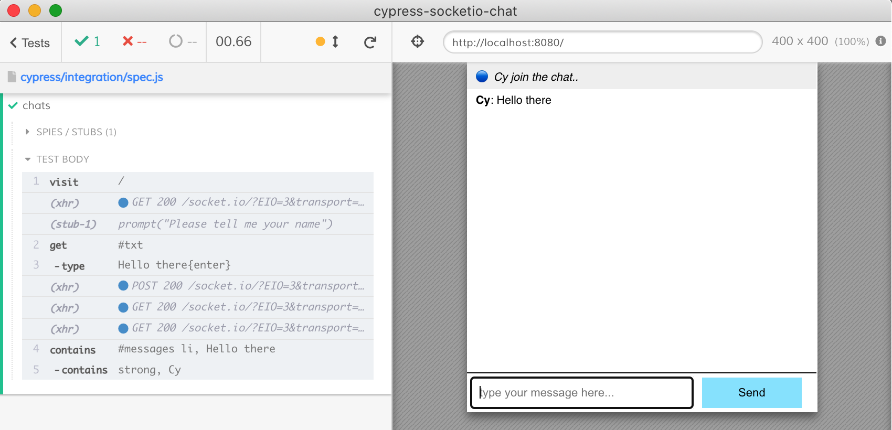

# cypress-socketio-chat
[![ci status][ci image]][ci url] [![badges status][badges image]][badges url] [![renovate-app badge][renovate-badge]][renovate-app] 
> Example testing real-time [Socket.io](https://socket.io/) chat using [Cypress.io](https://www.cypress.io/)

The original chat program copied from [dkhd/node-group-chat](https://github.com/dkhd/node-group-chat) as described in [Build A Group-Chat App in 30 Lines Using Node.js](https://itnext.io/build-a-group-chat-app-in-30-lines-using-node-js-15bfe7a2417b) blog post.

[ci image]: https://github.com/bahmutov/cypress-socketio-chat/workflows/ci/badge.svg?branch=main
[ci url]: https://github.com/bahmutov/cypress-socketio-chat/actions
[badges image]: https://github.com/bahmutov/cypress-socketio-chat/workflows/badges/badge.svg?branch=main
[badges url]: https://github.com/bahmutov/cypress-socketio-chat/actions
[renovate-badge]: https://img.shields.io/badge/renovate-app-blue.svg
[renovate-app]: https://renovateapp.com/
